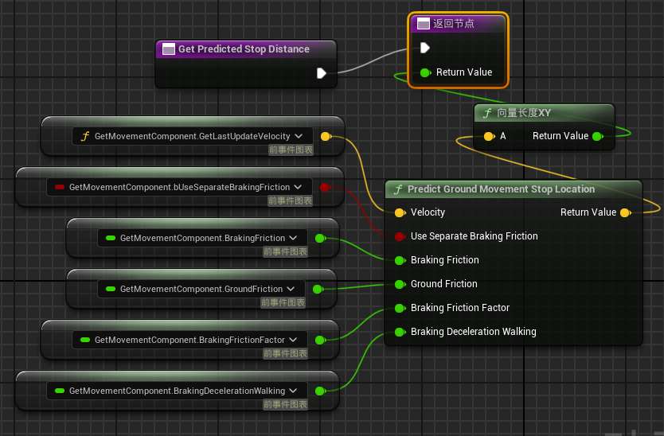

## `ABP_ItemAnimLayerBase` 的主要属性:

#### `HipFireUpperBodyOverrideWeight : float`

盲射时上半身混合权重. 当为1时, 角色会呈现举枪射击姿态
- 假设强行设该值为0, 当人物移动或跳起并射击时, 上半身不会呈现举枪姿态

#### `AimOffsetBlendWeight : float`
Idle AimOffset 的权重值, 每帧更新
- == 1: 使用 Idle AimOffset, 动画表现为人物手臂和头部会跟随瞄准
- == 0: 使用 Relaxed AimOffset, 动画表现为只有头部跟随瞄准

---

## BP Functions:

### `ChooseIdleBreakDelayTime()`
- 根据当前人物Location算一个随机值(float),作为 **IdleBreakDelayTime**
```ts
获取 GetMainAnimBP.WorldLocation
let a = int(ABS(WorldLocation.X + WorldLocation.Y))
let randomVal = a%10+6
设置 `IdleBreakDelayTime` = randomVal
```
<br>

### `CanPlayIdleBreak()`

- 根据六个bool 判断能否播放idleBreak
当处于**IdleBreak** State时,每帧调用

```ts
均从 GetMainBP.xxx 取值
let cannotPlayIdleBreak = `isCrouching`
|| `GameplayTag_IsADS` 
|| `GameplayTag_IsFiring`
|| `HasVelocity`
|| `IsJumping`
|| `IsAnyMontagePlaying`
return !cannotPlayIdleBreak
```

---

### `bool ShouldDistanceMatchStop()`

- "DistanceMatching" 相关
- Return `HasVelocity && !HasAcceleration`

### `AdvanceTimeByDistanceMatching()`

- "DistanceMatching" 相关, [Link](./DistanceMatching模块分析.md#advancetimebydistancematching)

### `DistanceMatchToTarget()`

- "DistanceMatching" 相关, [Link](./DistanceMatching模块分析.md#distancematchtotarget)

### `float GetPredictedStopDistance()`

- "DistanceMatching" 相关



---

### `UpdateBlendWeightData()` 

获取MainBP中角色状态相关属性, 计算 [射击动画] 相关两个关键属性: `AimOffsetBlendWeight` , `HipFireUpperBodyOverrideWeight`

- Called **each frame** in *`BPThreadSafeUpdateAnimation`*
```ts
if 下蹲时 || (站立时 && IsOnGround && IsADS)
    HipFireUpperBodyOverrideWeight = 0
    AimOffsetBlendWeight = 1
else // most time
    if 刚刚开过枪(TimeSinceFiredWeapon < 0.5) || 下蹲且ADS
        HipFireUpperBodyOverrideWeight = 1
        AimOffsetBlendWeight = 1
    else 
        // 动画表现为当角色移动时, 手臂会逐渐放下
        LERP HipFireUpperBodyOverrideWeight to 0 
        let target = 在移动 ? HipFireUpperBodyOverrideWeight : 1
        LERP AimOffsetBlendWeight to target
```