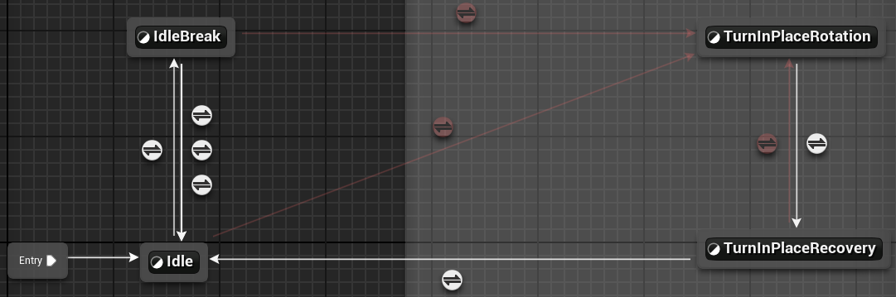

## FullBody_IdleState (AnimLayer)

内部使用 状态机IdleSM 进行Pose Output

## 1. 状态机 IdleSM (第一层)



---

### Idle 状态 
内部使用 [状态机IdleStance](#2-状态机-idlestance-第二层-inside-idle-状态-) 输出

##### 相关属性:
- `float TimeUntilNextIdleBreak`: 状态专用, 倒计时Counter
  `IdleBreakDelayTime`: 赋值给 TimeUntilNextIdleBreak

##### Transitions:
- => IdleBreak: when `TimeUntilNextIdleBreak` <= 0
- => TurnInPlaceRotation
  - **`ABS(MainBP.RootYawOffset) > 50`** // 共享判断

##### 变为相关时:
计算出一个随机值, 设为`IdleBreakDelayTime`, 然后**重置** `TimeUntilNextIdleBreak` = `IdleBreakDelayTime`

##### 更新时:
当State不处于 **BlendingOut** 阶段时, Try **update / reset** `TimeUntilNextIdleBreak`
```ts
if(!IsStateBlendingOut()) {
  let deltaTime = GetDeltaTime()
  if `CanPlayIdleBreak()`== true do TimeUntilNextIdleBreak -= deltaTime
  else CALL `ResetIdleBreakTransitionLogic()` //重置 TimeUntilNextIdleBreak
}
```
---

### IdleBreak 状态

主要负责播放 `Idle_Breaks` 动画

##### 相关属性:
- `CurrentIdleBreakIndex`

##### 相关Anim序列:
- `Idle_Breaks` Array

##### Transitions:
- => Idle: 
  - P1: `MainBP.GameplayTag_IsFiring == true` 
    //人物射击时也是idle状态?
  - P2: 自动播放完毕
  - P2: [CanPlayIdleBreak()](./Base.md#canplayidlebreak) == false
- => TurnInPlaceRotation
  - **`ABS(MainBP.RootYawOffset) > 50`** // 共享判断
  
##### 变为相关时:
- 按 **顺序** 播放IdleBreak动画:
```ts
  CALL SetSequence(Idle_Breaks[CurrentIdleBreakIndex])
  CurrentIdleBreakIndex++
```

---

### TurnInPlaceRotation 状态 

负责播放idle状态下站立和下蹲的转身动画

##### 相关属性:
- `MainBP.RootYawOffset`
  `float TurnInPlaceAnimTime` 
  // 积累 Evaluator 播放时间用于SetEplicitTime(), 也会给TurnInPlaceRecovery状态使用
  `float TurnInPlaceRotationDirection` 
  // 状态专属, 取值为1或-1, 用于判断转向

##### 相关Anim序列:
- `TurnInPlaceLeft` 转身动画
  `CrouchTurnInPlaceLeft`
  `TurnInPlaceRight` 
  `CrouchTurnInPlaceRight`

##### Transitions:
- => TurnInPlaceRecovery
  - `GetCurve("TurnYawWeight") == 0` 
  :star:// 完全依赖于动画曲线设置 
  // **可看出一旦进入本状态, 必需接着进入Recovery状态**


##### Output 变为相关时:
SET `TurnInPlaceRotationDirection` =  `MainBP.RootYawOffset > 0 ? -1:1`
// :star: 主Output结点的该方法**先于**Children动画节点 (如SequenceEvaluator) 执行
// RootYawOffset 值是和"转向"相反的, 所以这里取反向
// 由此可见 该状态会播哪个方向的转向动画直接由RootYawOffset决定
<br>


#### 主节点 `Seq Evaluator` 变为相关时:

SET `TurnInPlaceAnimTime = 0`, 并调用 `SetEplicitTime(0)`

#### :star: 主节点 `Seq Evaluator` 更新时:
- 根据当前转向值 `TurnInPlaceRotationDirection` 选择合适的Anim序列(`TurnInPlaceLeft 或 Right`)
  - CALL `SetSequenceWithInertialBlending()`
  // :warning: 这里要在Update中不断的获取动画并设置, 以便角色在站立和下蹲切换时，动画可以从正确的位置开始播放。
- `TurnInPlaceAnimTime += GetDeltaTime()`
  `SetEplicitTime( TurnInPlaceAnimTime )`
---

### TurnInPlaceRecovery 状态 
负责将转向动画的剩余部分播放完毕
- 主节点为 `Sequence Player`(和TurnInPlaceRotation中的SequenceEvaluator形成对比) 
会直接从 `TurnInPlaceAnimTime` 时间点开始播放动画
- **更新时:** 会不断获取动画并调用 `SetSequenceWithInertialBlending()`

##### Transitions:
- => TurnInPlaceRotation
  - **`ABS(MainBP.RootYawOffset) > 50`** // 共享判断
- => Idle
  动画播放完毕时

---

## 2. 状态机 IdleStance (第二层)

该FSM主要通过读取 GetMainBP 相关属性, 输出 Idle 动画
当 `GetMainBP.CrouchStateChange` 时,输出 Crouch **进入/离开**的动画

- 该FSM位于 **Idle状态内部**


---

### Idle 状态 

##### 相关属性:
- `GetMainBP.GameplayTag_IsADS`
  `GetMainBP.IsCrouching`
  `GetMainBP.CrouchStateChange` // Transition判断

##### 相关Anim序列:
- `idleADS`
  `idleHipFire`
  `CrouchIdle`

##### Transitions:
- => StanceTransition: when `GetMainBP.CrouchStateChange == true` 

##### 更新时:
- 根据 `GetMainBP.GameplayTag_IsADS` 和 `GetMainBP.IsCrouching`, 找出合适的Anim序列用于Idle
call `SetSequenceWithInertialBlending()` 

---

### StanceTransition 状态

一个持续时间短暂的过度用状态, 负责播放**切换下蹲时的Enter/Exit**动画

##### 相关属性:
- `GetMainBP.IsCrouching`
  `GetMainBP.CrouchStateChange` // Transition判断

##### 相关Anim序列:
- `CrouchIdleEntry`
  `CrouchIdleExit`

##### Transitions:
- => Idle: 
  - P1: when `GetMainBP.CrouchStateChange == true` 
  - P2: 动画播放完毕

##### Ouput 变为相关时:
- 根据`GetMainBP.IsCrouching` 播放 `CrouchIdleExit` 或 `CrouchIdleEntry`

