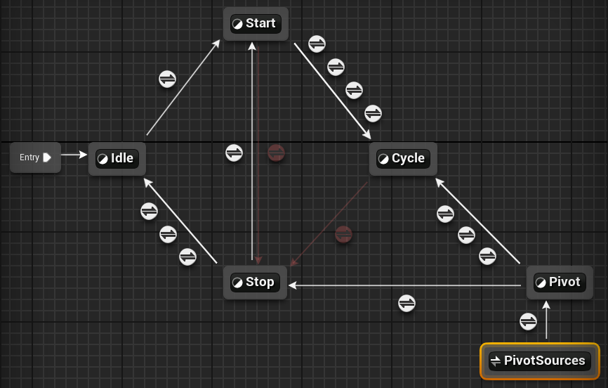
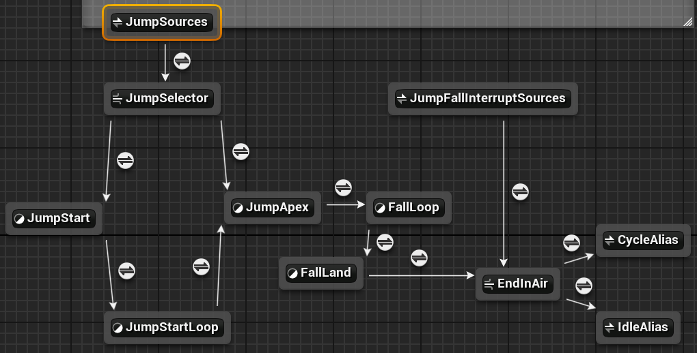

# FSM Locomotion 分析

## 1. 基础移动 Graph

---

### 1.1 Idle 状态
[Layer : FullBody_IdleState](../ABP_ItemAnimLayerBase分析/FullBody_IdleState实现.md)
##### 相关属性:
- `TurnYawCurveValue`

  `RootYawOffsetMode`

  `RootYawOffset` [核心属性](./Basics.md#rootyawoffset--float-star)

##### Transitions:
- => Start: `GameplayTag_IsMelee && HasVelocity || HasAcceleration` 为True时

#### Output 更新时:
- **if** Not BlendingOut  
  - `RootYawOffsetMode = Accumulate`
  - CALL `ProcessTurnYawCurve()` 

  **else** `TurnYawCurveValue = 0`

 

### :mag: `ProcessTurnYawCurve()` 

核心方法, **Called Only** in State Idle

1. `let previousTurnYawCurveValue = TurnYawCurveValue`
2. 判断**当前动画**的转向**权重**, 并赋值 `TurnYawCurveValue`
   - `let weight = GetCurveValue("TurnYawWeight")` 
   - **if** `weight == 0`  // 表示该动画不再影响Root转向
     - `previousTurnYawCurveValue = TurnYawCurveValue = 0`

     **else**
      - `TurnYawCurveValue = GetCurveValue("RemainingTurnYaw") / weight`
    
      > 以动画 "TurnLeft_90"为例, 此时 weight 为 1   
      其 RemainingTurnYaw 为 -90 >> 0 线性插值变化  
      其 TurnYawWeight 代表权重, 1 => 0 直接切换 **(当为0时会触发内部 Transition to TurnInPlaceRecovery)**  
      :pushpin: 因此 `TurnYawCurveValue` 可看作是 **有效的剩余旋转Yaw值**

3. **if** `previousTurnYawCurveValue != 0` 
   - `let targetRootYawOffset = RootYawOffset - (TurnYawCurveValue - previousTurnYawCurveValue)`
   - CALL [SetRootYawOffset](./BPThreadSafeUpdate流程.md#setrootyawoffsetfloat-newrootyawvalue-实现)(targetRootYawOffset)
    
      // 逐渐归零 RootYawOffset, 进而驱动下半身旋转

---

### 1.2 Start 状态

[Layer : FullBody_StartState](../ABP_ItemAnimLayerBase分析/FullBody_StartState实现.md)

##### 相关属性:
- `RootYawOffset`

  `RootYawOffsetMode`

  `Enum LocalVelocityDirection`

  `Enum StartDirection` // 状态专属

##### Transitions:
- => Cycle

  - P1 ABS(`RootYawOffset`) > 60
    - todo...??

  - P1 动画Layer改变: `LinkedLayerChanged`

  - P2 自动播放完毕

  - P3 处理其他情况以便更快进入Cycle:

    `StartDirection != LocalVelocityDirection`(例如向左开始横向移动后立刻按前)

    || `CrouchStateChange`

    || 切换下蹲

    || `ADSStateChanged` 

- => Stop
  - `GameplayTag_IsMelee` && `HasVelocity` || `HasAcceleration` 为False时 
  
    // **共享Rule, 和 Idle => Start 判断正好相反**

- => Pivot
  - 人物Local加速度和Local速度的方向反向时 && `IsRunningIntoWall == false`
    
    // 和 Cycle => Pivot 一致

#### Output 变为相关时:
- 记录初始速度方向: `StartDirection = LocalVelocityDirection`

#### Output 更新时:
- **if** Not BlendingOut, `RootYawOffsetMode = Hold`
  - [为什么要设为Hold](./Basics.md#rootyawoffsetmode--enum)

---

### 1.3 Stop 状态

[Layer : FullBody_StopState](../ABP_ItemAnimLayerBase分析/FullBody_StopState实现.md)

##### 相关属性:
- `RootYawOffsetMode`

##### Transitions:
- => Idle
  - P1 动画Layer改变: `LinkedLayerChanged`
  - P2 切换姿势: `CrouchStateChange` || `ADSStateChanged`
  - P3 自动播放完毕

- => Start
  - 有速度时立刻切换回Start: `HasAcceleration == true`

#### Output 更新时:
- **if** Not BlendingOut, `RootYawOffsetMode = Accumulate`

  // :pushpin: Stop 状态下持续设为 Accumulate 模式, 以便 `this.UpdateRootYawOffset()` 能持续累积 `RootYawOffset` 属性

---
### 1.4 Cycle 状态
[Layer : FullBody_CycleState](../ABP_ItemAnimLayerBase分析/FullBody_CycleState实现.md)
##### Transitions:

- => Stop
  - `GameplayTag_IsMelee` && `HasVelocity` || `HasAcceleration` 为False时 
  
    // **共享Rule, 和 Idle => Start 判断正好相反**

- => Pivot
  - 人物Local加速度和Local速度的反向时 && `IsRunningIntoWall == false`
    
    // 和 Start => Pivot 一致
---

### 1.5 Pivot 状态 

处理人物急转身相关动画, [Layer : FullBody_PivotState](../ABP_ItemAnimLayerBase分析/FullBody_PivotState实现.md)

- :warning:当呈现加速度和速度反向后, 人物仍会保持**当前速度方向**前进小段距离, 直到达到 Pivot 点

##### 相关属性:
- `LocalVelocity2D`

  `LocalAcceleration2D`

  `IsRunningIntoWall`

  `Enum LocalVelocityDirection`

  `LinkedLayerChanged`

  `HasAcceleration`

  `CrouchStateChange`

  `ADSStateChanged`

  `Enum PivotInitialDirection` // 状态专属, 初始速度方向枚举

  **`LastPivotTime`** [核心属性](./Basics.md#lastpivottime--float) // **被 Anim Layer 赋值**

##### Transitions
- => Stop 
  - 无加速度时: `HasAcceleration == false`
- => Cycle 
  - P1 动画Layer改变: `LinkedLayerChanged`
  - P2: `WasAnimNotifyStateActiveInSourceState( "TransitionToLocomotion" )` ?? todo
  - P3 当切换姿势或移动方向垂直于Pivot动画方向时:
    - `CrouchStateChange` || `ADSStateChanged`
|| 当前 `LocalVelocityDirection` **垂直于** `PivotInitialDirection`  && `LastPivotTime` <= 0

#### Output 变为相关时:

- 初始化 Pivot 速度方向枚举: `PivotInitialDirection = LocalVelocityDirection`

#### Output 更新时:
- **if** `LastPivotTime > 0`, `LastPivotTime -= GetDeltaTime()`

---

## 2. 跳跃 Graph
[Layer : FullBody_JumpAndFall](../ABP_ItemAnimLayerBase分析/FullBody_JumpAndFall实现.md)

---

### JumpSelector 导管

##### Transitions:
- => JumpStart: `IsJumping == true`
- => JumpApex: `IsFalling == true`
  > 非起跳悬空落地的情况

 

### JumpStart 状态 

对应人物起跳时段

##### Transitions:
- => JumpStartLoop: 动画播放完毕

 

### JumpStartLoop 状态 

对应人物跳跃上升过程

##### 相关属性:
- `TimeToJumpApex`

##### Transitions:
- => JumpApex: `TimeToJumpApex < 0.4(常量)` 
  
  >:pushpin: 这里的0.4秒**和实际的 JumpApex 动画序列有耦合**  , 该类序列具有 *RootMotion* 且会正好在0.4秒开始下落

 

### JumpApex 状态 

对应人物跳跃至最高点的时段

##### Transitions:
- => FallLoop: 动画播放完毕
---

### FallLoop 状态 

对应人物下落过程

##### 相关属性:
- `float GroundDistance`

##### Transitions
- => FallLand: `GroundDistance` < 200

 

### FallLand 状态 

对应人落地时段

##### 相关属性:
- `bool IsOnGround`

##### Transitions
- => EndInAir **导管**: `IsOnGround == true`

 

### JumpFallInterruptSources 别名

:warning: 包括以上五种跳跃相关状态, 任何时候IsOnGround时, 退出 "Jump状态集"

##### Transitions
- => EndInAir **导管**: `IsOnGround == true`
  
 

### EndInAir 导管 
##### Transitions
- => Cycle 
  - P1 `HasAcceleration == true`
- => Idle
  - P2 **Always True** // 无加速度时

