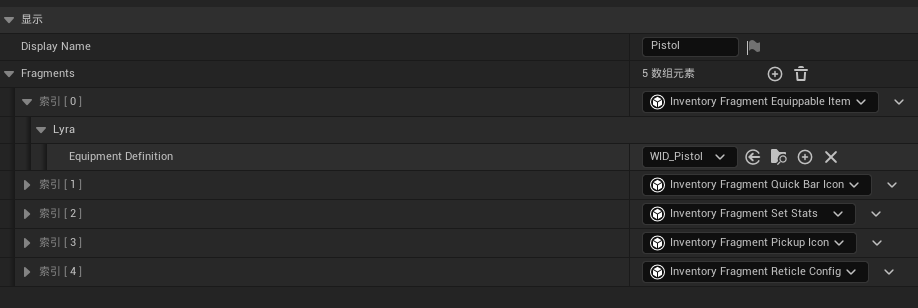
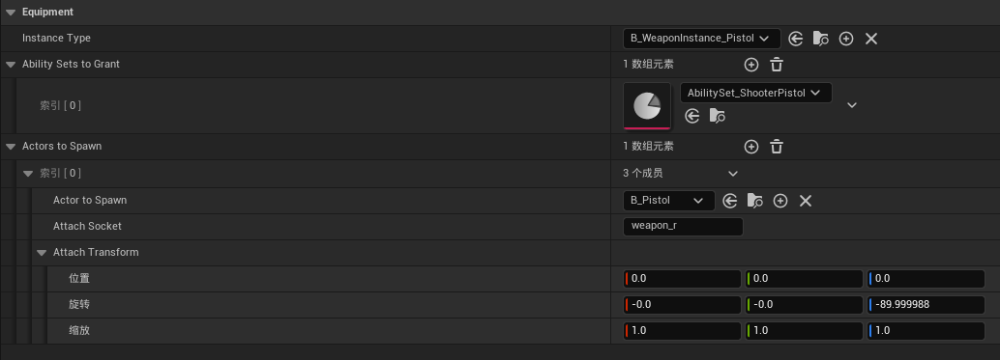

# Lyra Weapon and Equipment 


> :books: Lyra 中, 一件 "装备" 的本质是一个 **InventoryItem with a "Equipment-Type" Fragment**,  因此可以说 the Weapon/Equipment System **is based on** the Inventory System

- 关系参考 [InventoryItem / Equipment / Weapon 之间的关系](./Lyra_Inventory.md#inventoryitem--equipment--weapon-之间的关系)
---

### ULyraEquipmentDefinition : UObject

装备 **配置层** 定义, 该配置建立了以下三者之间的联系:

- [Weapon Instance](#weapon-instance)
- 装备相关的 Gameplay Abilities 
- [Weapon Actor](#weapon-instance)

```cpp
UCLASS(Blueprintable, Const, Abstract, BlueprintType)
class ULyraEquipmentDefinition : public UObject
{
	UPROPERTY(EditDefaultsOnly, Category = Equipment)
	TSubclassOf<ULyraEquipmentInstance> InstanceType;

	UPROPERTY(EditDefaultsOnly, Category = Equipment)
	TArray<TObjectPtr<const ULyraAbilitySet>> AbilitySetsToGrant;

	UPROPERTY(EditDefaultsOnly, Category = Equipment)
	TArray<FLyraEquipmentActorToSpawn> ActorsToSpawn;
};

USTRUCT()
struct FLyraEquipmentActorToSpawn
{
	UPROPERTY(EditAnywhere, Category = Equipment)
	TSubclassOf<AActor> ActorToSpawn;

	UPROPERTY(EditAnywhere, Category = Equipment)
	FName AttachSocket;

	UPROPERTY(EditAnywhere, Category = Equipment)
	FTransform AttachTransform;
};
```

<br>

### Pistol 配置示例

`B_Hero_ShooterMannequin`(`ALyraCharacter`) has:
  - has a member that refers to asset *"ID_Pistol"*

*"ID_Pistol"* (`ULyraInventoryItemDefinition`) has:
  - 五个 Fragments, 其中之一的类型为 `InventoryFragment_EquippableItem`
    - refers to asset *"WID_Pistol"*  



*"WID_Pistol"* (`LyraEquipmentDefinition`) has:
  - TSubclassOf **Weapon Instance**: `B_WeaponInstance_Pistol`
  -  手枪相关 GA 例如 `"GA_Weapon_Fire_Pistol"`, `"GA_Weapon_Reload_Pistol"`
  - TSubclassOf **Weapon Actor**: `B_Pistol`



---

### ULyraEquipmentInstance : UObject

装备 **逻辑层** 实例

##### 主要属性:
```cpp
UPROPERTY(ReplicatedUsing=OnRep_Instigator)
TObjectPtr<UObject> Instigator; // 生成来源 InventoryItem

UPROPERTY(Replicated)
TArray<TObjectPtr<AActor>> SpawnedActors; // 装备 Actors 引用
```

##### 主要方法:

#### `SpawnEquipmentActors(const TArray<FLyraEquipmentActorToSpawn>& ActorsToSpawn)`
- 负责生成显示曾装备 Actors, 并添加到 `this.SpawnedActors`
---

### Weapon Instance 

>:memo: 指代 Lyra 中的武器 **逻辑层** 实例
 
##### 类结构
- **`ULyraEquipmentInstance`**
  - `ULyraWeaponInstance`
    - `ULyraRangedWeaponInstance` 
	  - `B_WeaponInstance_Base` (BP)
	    - `B_WeaponInstance_Pistol`
		- `B_WeaponInstance_Rifle`
		- `B_WeaponInstance_Shotgun`


##### 类关系:
- Contained by `ULyraEquipmentManagerComponent::EquipmentList`

#### 子类扩展内容:
`ULyraWeaponInstance` Add:
  - **Anim Layer 配置相关, 使 Character 在切换武器时, 能够同时切换到正确的 Anim Layer 并 Link**

:pushpin: `ULyraRangedWeaponInstance` Add:
- 射击武器专有的属性, 例如: 最大击中距离(`MaxDamageRange`), 武器扩散角度(`CurrentSpreadAngle`)
  - :warning: 武器的基础伤害是定义在相关 GameplayEffect 中的
- 射击相关逻辑
- Tick 方法, 主要用于 Update Spread

`B_WeaponInstance_Base` Add: 
- `AnimMontage` references: 装备/卸载武器, 近战攻击等 

`B_WeaponInstance_Pistol` 等基本为纯数据蓝图

---


### Weapon Actor
>:memo: 指代 Lyra 中的武器 **显示层** 实例
- `B_Weapon` 为 **显示层** 武器 Actor 蓝图基类 
  - 添加了 `USkeletalMeshComponent` 用于展示武器模型
  - Handle 显示层 Fire 
- 继承关系: `B_Pistol`/ `B_Pistol`  << `B_Weapon`(BP) << `AActor`


##### 主要属性:

`BWeaponFire(Actor) weaponFire`: 开火效果  
`BWeaponImpact(Actor) weaponImpact`: 击中效果  
`BWeaponDecal(Actor) weaponDecal`: 弹坑效果  

---
### ULyraEquipmentManagerComponent : UPawnComponent

`LyraCharacter` 的核心组件之一, 负责记录/管理其Pawn Owner 持有具体哪些装备, 并负责处理 Equip/Unequip 等行为

##### 主要属性:
`FLyraEquipmentList EquipmentList` *Replicated*
- Contains Equipment Instances

##### 主要方法:
#### `ULyraEquipmentInstance* EquipItem(TSubclassOf<ULyraEquipmentDefinition> EquipmentDefinition)`
- 会触发 `SpawnEquipmentActors()` 方法


---

### ULyraWeaponStateComponent :  UControllerComponent

负责武器状态跟踪; 客户端预测记录;

##### 主要方法:
#### `TickComponent(float DeltaTime, enum ELevelTick TickType, FActorComponentTickFunction* ThisTickFunction)`

1. 从 Pawn 上获取 `ULyraEquipmentManagerComponent` 
2. 通过 `ULyraEquipmentManagerComponent` 找到 Current Weapon Instance
3. **驱动 Weapon Instance Tick**


