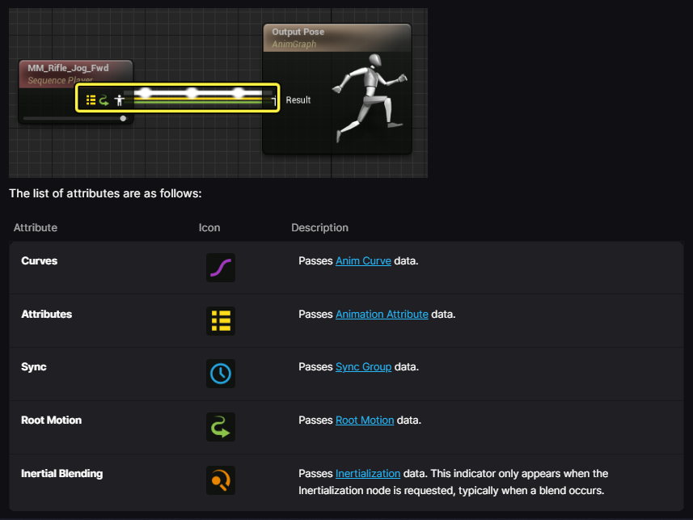

# Unreal 动画基础

<br>

#### 线路输出示意图:


---

## Animation Layer Interface 动画层接口

动画层接口, 可类比于`public Interface`
使用方式为: Anim BP 可 implements 该接口从而 implements its LinkedAnimLayers

- **必须先创建  `AnimationLayerInterface`** 才能声明 `LinkedAnimLayers` 
  - 由此可见一个 `LinkedAnimLayer` 可看作是一个 "Interface方法"

:warning: 需要注意和传统接口概念不同的是, ALI 更像是一个"Weak Interface", AnimBP 可以**选择性地实现任意数量**的 LinkedAnimLayers

<br>

## AnimGraph

- Linked Anim Graph acts as a **"Class" Reference** to another Anim BP

<br>

###   Linked Anim Layer 对比 Anim Layer ??

前者:
- 可声明 N 个 Linked Anim Layers 
- slot 必须用在 mainAnimBP, 不能放在linked anim中

---

## AnimNotify

实现原则基于 **Unreal's Reflection System** and **Event-Driven Programming**.

- All Notifies should be non-Blueprint based, to avoid calls to the Blueprint Virtual Machine.
- Notifies should be performed on the game thread, as they can affect the animated object's lifetime.

##### 一个自定义`UAnimNotify` in C++示例:
```cpp
UCLASS()
class UMyAttackNotify : public UAnimNotify
{
    GENERATED_BODY()
public:
    virtual void Notify(USkeletalMeshComponent* MeshComp, UAnimSequenceBase* Animation) override
    {
        if (AActor* Owner = MeshComp->GetOwner())
        {
            if (IAttackInterface* Interface = Cast<IAttackInterface>(Owner))
            {
                Interface->Execute_DoAttack(Owner);
            }
        }
    }
};
```

---

### Anim Slot and Slot Group 动画插槽 

> :memo: 主要用于处理动画间的 **Override** 和 **Interrupt** 需求

Anim Slot 可看作是一个动画层 “占位符”

- 主要功能: 在AnimBP中放置Slot节点 to override the incoming animation when some AM played 
- **一个 AM needs at least one Slot to Play??**
- 隶属于某个 SlotGroup
- 动画插槽名称由两部分组成 (SlotGroup.SlotName), 例如 "DefaultGroup.UpperBody"

Slot Group 可看作是一个 *Named Anim Channel*

- **Interrupt 规则:** 同一个 Slot Group 内，任意时刻只能播放一个 Montage
  - 当 Play AM 时, 它会占用相关的Slots => 占用 SlotGroups => 正在这些SlotGroups上播放的动画会被打断

  - 例如 "轻攻击AM" 和 "重攻击AM" 可使用同一个 MeleeGroup
- 不同 Group 之间的 Montage 是独立运行、互不干扰的
  - 例如可按 FullbodyGroup, UpperbodyGroup, FaceGroup 分类
  

---

### Blend Mask 混合遮罩 / Blend Profile 混合描述文件

:star: 相关数据储存在 `.Skeleton` asset 中, 也只能在 Skeleton Edtior 中编辑

**BlendMask:** Used to control which bones on a character skeleton are affected by a specific animation blend, and **by how much**

- 数据结构: A BlendMask = a collection of **per-bone** blend weights (0–1)
    - 1.0 => anim fully affects this bone
    - 0.0 => anim does NOT affect this bone
    - 0.5 => anim has partial effect

---

### Sync Group 同步组

---
### Anim Curve 动画曲线
###### What `GetCurveValue("CurveName")` means in an Anim BP ?

