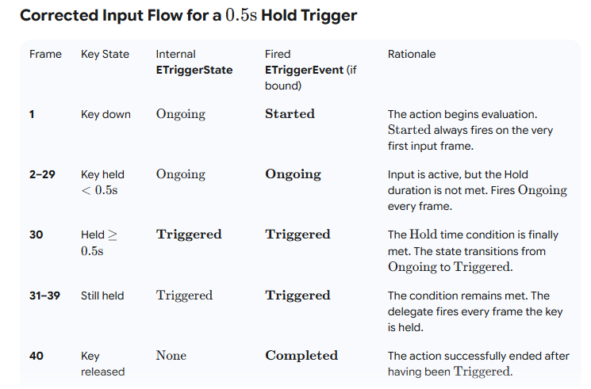

# EnhancedInput 分析
## 1. 基础概念:

### User Inputs 
玩家实际输入

### Input Action (IA) 

Input Actions are the **BRIDGE** between the Enhanced Input System and the Game Logic
- IA 是一种行为层的抽象, represents a high-level **logical action**, one thing that the player can do
  - 例如 "IA_Crouch", "IA_FireWeapon"
- IA has **at least One** *Triggers*, and can have multiple *Modifiers*
- IA 具有 "消耗输入" 属性: if the IA is triggered by an input, the input event will be "consumed"
 

### Input Mapping Context (IMC)

Map **User Inputs** to **Input Actions**

- **多个** Input Mapping Context can be in use at one time
- IMCs 可在runtime时**动态添加** to make small changes to gameplay.
 

### :star: Input Trigger
继承自 `UObject`, it determines whether the current **User Inputs** have met its conditions like (DeadZone, HoldTime) to activate the mapped **Input Action**
 

### :star: Input Modifier
**Process Input Action Value** from User Raw Input, and return the value which is then passed to an action event
 

### Trigger States 

:memo: Input Action 在运行时是具有 **Lifecycle** 的, 每一个 IA **holds one Trigger State at any moment** that describes what phase of activation it’s in during that frame. 
- 使用者可对任意State绑定callback

**:warning: 所有 Input Triggers "共同"决定**: For the action to fire `Triggered` state, ALL implicit and explicit Input Triggers must be satisfied (unless a trigger is specifically set to be "Blocking" or "Explicit")

- 各种触发状态:
  - **`Triggered`**: The action is "active" and **输出 values** (can last multiple frames).

  - **`Started`**: The very first frame the action becomes active.

  - **`Ongoing` (注意)**: InputAction is in progress but not yet satisfying trigger conditions.

  - **`Completed` / `Canceled`**: 待确认

---

## 2. Input 流程

1. UserInput => 原始的 Input Action Value (IAV)
2. IAV => Modifiers in IMC => IAV 
3. IAV = > Modifiers in IA => Final IAV
4. All Triggers attached to the IA execute their **Evaluation** logic using the Final IAV and time data, resulting in a single `ETriggerEvent` state for the Input Action.

#### 示例:
